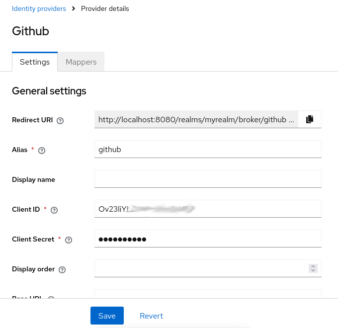

# React - App mit KeyCloak - Auth

## KeyCloak

1. ggf. als Docker-container: `docker run -p 8080:8080 -e KC_BOOTSTRAP_ADMIN_USERNAME=admin -e KC_BOOTSTRAP_ADMIN_PASSWORD=admin quay.io/keycloak/keycloak:26.1.3 start-dev` 
1. anmelden auf localhost:8080 (admin:admin)
1. Realm *myreal* erstellen
2. Im Realm einen client erstellen
    - client id: `demo_client`
    - redirect-url: `http://localhost:5173/*`
    - web origin: `http://localhost:5173`
3. Realm Benutzer erstellen

## React

* `npm install @react-keycloak/web keycloak-js`
* code + config siehe **main.jsx** und **App.jsx**

## Setup Github Auth within Keycloak

* Realm-based setup as Identitxy Provider

* in Github,m create a new Githup app, configure the redirect url accoridng to keycload IdP, and copy client id and secret into the configuration within Keycloak

